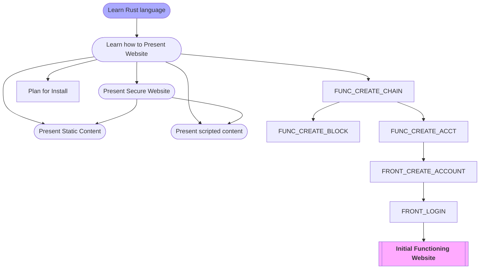

## Core Functionality

```mermaid
flowchart TD;
    %% LEARN  - Initial learning of some functionality
    %% PLAN   - Design, or list the expected requirements.
    %% FUNC   - Functionality
    %% API    - Specific API functionality that will be required to perform the functionality.
    %% FRONT  - Functionality at the front-end (the browser) to perform some some functionality.

    %% To mark an item as completed (afa=green, faf=purple, aaf=blue)
    %% style EXAMPLE fill:#afa

    %% To provide a link
    %% A[<a href='https://google.com'>works</a>]
    %%--------------

    %% Completed (#afa)
    %% style EXAMPLE fill:#afa

    %% Active (#aaf)
    style LEARN_RUST fill:#aaf

    %%--------------


    %% Have not developed anything yet with Rust, so this is an opportunity to learn it.
    LEARN_RUST([Learn Rust language])
    
    %% After learning the general Rust language, need to learn how to use it to present a website
    LEARN_RUST_WEB([Learn how to Present Website])
    LEARN_RUST --> LEARN_RUST_WEB
    
    %% When presenting a website, need to be able to secure it.  Would be good to be able to do that directly in our app, rather than relying on a proxy in-front
    LEARN_RUST_WEB_CERTS([Present Secure Website])
    LEARN_RUST_WEB --> LEARN_RUST_WEB_CERTS
    
    %% Want to be able to present static content.   Originally from direct file content (often deployed).  Eventually would want to also be able to present static content from a Block.
    LEARN_RUST_WEB_STATIC([Present Static Content])
    LEARN_RUST_WEB --> LEARN_RUST_WEB_STATIC
    LEARN_RUST_WEB_CERTS --> LEARN_RUST_WEB_STATIC 
    
    %% There may be cases where we want to run something dynamically on the endpoint.
    LEARN_RUST_WEB_DYNAMIC([Present scripted content])
    LEARN_RUST_WEB --> LEARN_RUST_WEB_DYNAMIC
    LEARN_RUST_WEB_CERTS --> LEARN_RUST_WEB_DYNAMIC
    
    %% When people are using the backend, need to plan how we are expecting it to be first setup.
    PLAN_BACKEND_INSTALL[Plan for Install]
    LEARN_RUST_WEB --> PLAN_BACKEND_INSTALL


    %% The backend will be able to gather information for the front-end, but wont actually know the content of it.   Each chain can have read-only access potentially, but a seperate key will be needed to modify (add to) the chain.
    FUNC_CREATE_CHAIN
    LEARN_RUST_WEB --> FUNC_CREATE_CHAIN

    FUNC_CREATE_BLOCK
    FUNC_CREATE_CHAIN --> FUNC_CREATE_BLOCK

    %% When a user is creating an account for the service, need to then setup some chains and blocks.
    FUNC_CREATE_ACCT
    FUNC_CREATE_CHAIN --> FUNC_CREATE_ACCT

    FRONT_CREATE_ACCOUNT
    FUNC_CREATE_ACCT --> FRONT_CREATE_ACCOUNT

    FRONT_LOGIN  --> TARGET
    FRONT_CREATE_ACCOUNT --> FRONT_LOGIN

    TARGET[["`**Initial Functioning Website**`"]]
    style TARGET fill:#faf
```

## Secondary Functionality

```mermaid
flowchart TD;
```
